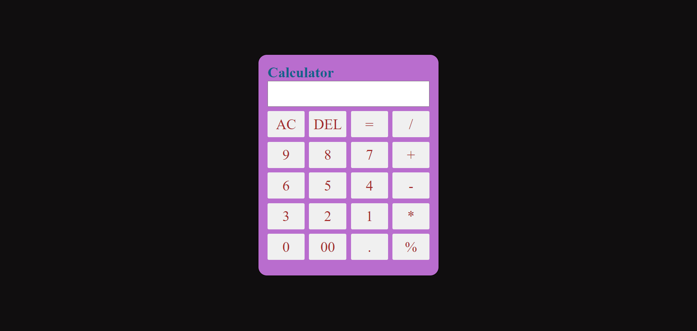

# calculator - TechnoHacks

## Aim 
Develop a calculator app that performs basic math operations.

## Program 
cal.html
```
<!DOCTYPE html>
<html lang="en">
<head>
  <meta charset="UTF-8">
  <meta name="viewport" content="width=device-width, initial-scale=1.0">
  <link rel="stylesheet" href="cal.css">
  <title>Calculator App</title>
</head>
<body>

  <div class="calculator">
    <h1 style="color: rgb(19, 97, 139)">Calculator</h1>
    <input type="text" id="display" readonly>
    <div class="buttons">
      <button onclick="clearDisplay()">AC</button>
      <button onclick="deleteLast()">DEL</button>
      <button class="opera" onclick="calculate()">=</button>
      <button class="operation" onclick="appendToDisplay('/')">/</button>
      <button onclick="appendToDisplay('9')">9</button>
      <button onclick="appendToDisplay('8')">8</button>
      <button onclick="appendToDisplay('7')">7</button>
      <button class="operation" onclick="appendToDisplay('+')">+</button>
      <button onclick="appendToDisplay('6')">6</button>
      <button onclick="appendToDisplay('5')">5</button>
      <button onclick="appendToDisplay('4')">4</button>
      <button class="operation" onclick="appendToDisplay('-')">-</button>
      <button onclick="appendToDisplay('3')">3</button>
      <button onclick="appendToDisplay('2')">2</button>
      <button onclick="appendToDisplay('1')">1</button>
    
      <button class="operation" onclick="appendToDisplay('*')">*</button>
      <button onclick="appendToDisplay('0')">0</button>
      <button onclick="appendToDisplay('00')">00</button>
      <button class="operation" onclick="appendToDisplay('.')">.</button>
      

      <button class="operation" onclick="appendToDisplay('%')">%</button>
      
    </div>
  </div>

  <script src="cal.js"></script>
  

</body>
</html>

```
cal.css
```
*{
  margin:0;
  padding:0;
  font-family:'poppins','sans-serif';
  box-sizing:border-box;
}
body {
  display: flex;
  justify-content: center;
  align-items: center;
  height: 100vh;
  width: 100%;
  margin: 0;
  background-color:rgb(16, 14, 15);
}

.calculator {
  background:rgb(185, 109, 206);
  width: 400px;
  height: 490px;
 
  border: 2px solid rgb(11, 8, 8);
  border-radius: 20px;
  padding: 20px;
}

#display {
  width: 100%;
  box-sizing: border-box;
  margin-bottom: 10px;
  padding: 8px;
  font-size: 2em;
}

.buttons {
  display: grid;
  grid-template-columns: repeat(4, 1fr);
  grid-gap: 10px;
  border: brown;
}

button, .operation {
  color: brown;
  width: 100%;
  padding: 10px;
  font-size: 2em;
  border: none;
  border-radius: 3px;
  cursor: pointer;
}

.operation {
  background-color: #f0f0f0;
}

button:active, .operation:active {
  background-color: #ddd;
}
```
cal.js
```
let displayValue = '';

function appendToDisplay(value) {
  displayValue += value;
  document.getElementById("display").value = displayValue;
}

function clearDisplay() {
  displayValue = '';
  document.getElementById("display").value = displayValue;
}
function deleteLast() {
    displayValue = displayValue.slice(0, -1);
    document.getElementById("display").value = displayValue;
  }
function calculate() {
  try {
    displayValue = eval(displayValue);
    document.getElementById("display").value = displayValue;
  } catch (error) {
    document.getElementById("display").value = "Error";
  }
}

```
## Output

